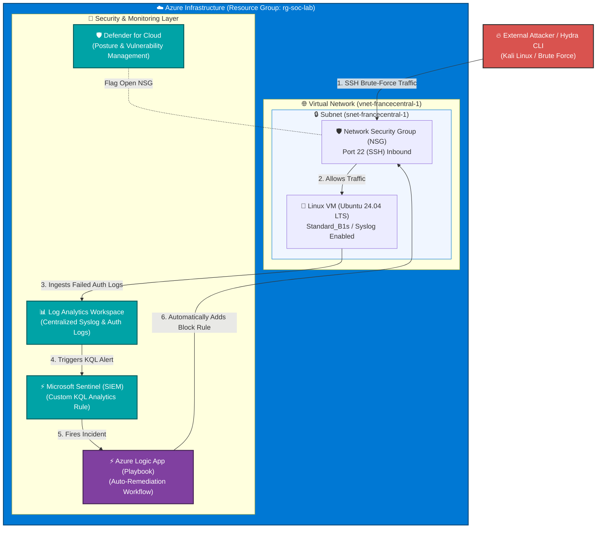

```mermaid
flowchart TD
    %% Styling and Classes
    classDef attacker fill:#d9534f,stroke:#2b2b2b,stroke-width:2px,color:#fff;
    classDef azureBox fill:#0078d4,stroke:#004578,stroke-width:2px,color:#fff;
    classDef subnetBox fill:#f0f6ff,stroke:#0078d4,stroke-width:1px,color:#333;
    classDef secService fill:#00a3a6,stroke:#005a5b,stroke-width:2px,color:#fff;
    classDef logicApp fill:#8040a0,stroke:#402050,stroke-width:2px,color:#fff;

    %% External Attacker
    Attacker["🔥 External Attacker / Hydra CLI<br/>(Kali Linux / Brute Force)"]:::attacker

    %% Azure Infrastructure Perimeter
    subgraph AzureEnv ["☁️ Azure Infrastructure (Resource Group: rg-soc-lab)"]
        direction TB

        subgraph VNet ["🌐 Virtual Network (vnet-francecentral-1)"]
            subgraph Subnet ["🔒 Subnet (snet-francecentral-1)"]
                NSG["🛡️ Network Security Group (NSG)<br/>Port 22 (SSH) Inbound"]
                LinuxVM["🐧 Linux VM (Ubuntu 24.04 LTS)<br/>Standard_B1s / Syslog Enabled"]
            end
        end

        %% Security & SIEM Layer
        subgraph SecurityTier ["🔐 Security & Monitoring Layer"]
            MDC["🛡️ Defender for Cloud<br/>(Posture & Vulnerability Management)"]
            LAW["📊 Log Analytics Workspace<br/>(Centralized Syslog & Auth Logs)"]
            Sentinel["⚡ Microsoft Sentinel (SIEM)<br/>(Custom KQL Analytics Rule)"]
            LogicApp["⚡ Azure Logic App (Playbook)<br/>(Auto-Remediation Workflow)"]:::logicApp
        end
    end

    %% Flow Directions
    Attacker -->|"1. SSH Brute-Force Traffic"| NSG
    NSG -->|"2. Allows Traffic"| LinuxVM
    LinuxVM -->|"3. Ingests Failed Auth Logs"| LAW
    MDC -.-|"Flag Open NSG"| NSG
    LAW -->|"4. Triggers KQL Alert"| Sentinel
    Sentinel -->|"5. Fires Incident"| LogicApp
    LogicApp -->|"6. Automatically Adds Block Rule"| NSG

    %% Applying Classes
    class AzureEnv azureBox;
    class Subnet subnetBox;
    class MDC,LAW,Sentinel secService;
```
